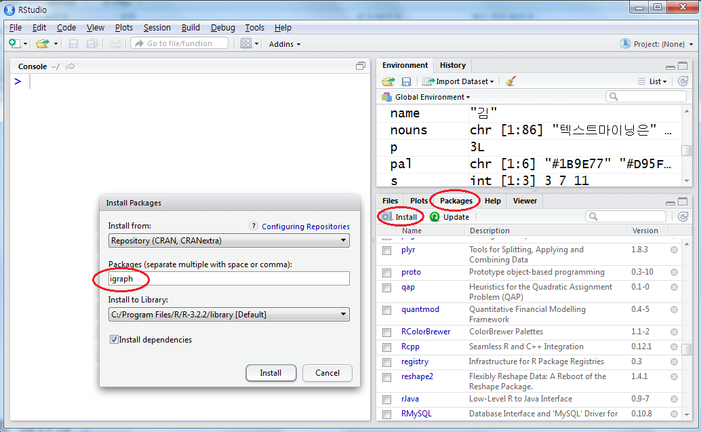
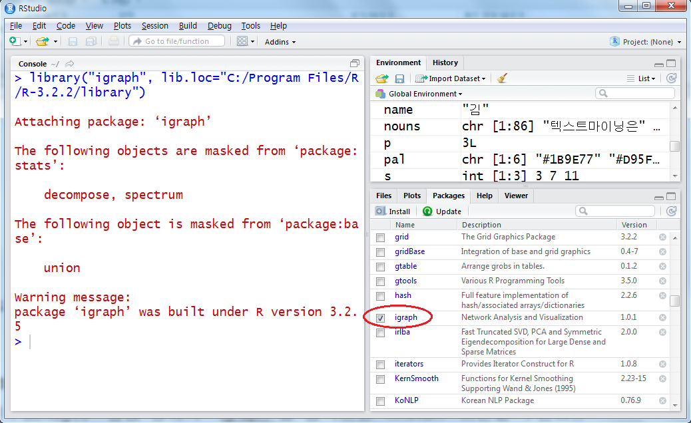

```{r setup, include=FALSE}
knitr::opts_chunk$set(echo = TRUE)
```

# R 

R 프로그램은 공개 소프트웨어라는 점 이외에 아래와 같은 다양한 장점을 가지고 있다.

- 대화식의 프로그램 수행 및 결과물의 객체화

- 쉬운 프로그래밍

- 다양한 확장성 : UNIX, 맥킨토시, 윈도우즈 등의 다양한 컴퓨터 운영체제에서 R 소프트웨어 사용이 가능하며, JAVA, C, Fortran 등의 언어와의 인터페이스 지원과 각종 데이터 접근이 용이한 확장성을 지닌다.

- 전 세계 사용자들에 의해 작성된 최신의 다양한 함수와 패키지의 활용성.

## 사전 지식

### (1) 주석(comments)

- "#" 다음에 나타나는 모든 문장은 주석으로서 실행에 영향을 미치지 않는다.

- 명령어 문장을 설명하는 목적으로 주로 사용된다.

```{r, fig.show='hide'}
1+2 #두 수의 합
```

- 위 계산 결과에서 “[1]”의 표시는 결과값 중 몇 번째인가를 나타내는 번호다. 여기서는 결과값이 1개이므로 “[1]” 만 표시되었다.

### (2) 

- 할당문은 실행은 되지만 그 결과는 콘솔창에 나타내지 않는다. 

- 할당 결과를 콘솔에 나타내려면 “( )”로 감싼다.

```{r, fig.show='hide'}
x=2
```

```{r, fig.show='hide'}
(x=2)
```

### (3) ; 세미콜론

- 명령문들의 구분은 세미콜론 “;”으로 한다.

```{r, fig.show='hide'}
x=2; y=x+1; x; y
```

### (4) 할당 기호 “<-”과 “=”

- 변수에 어떤 값을 할당하는 R의 공식적 명령기호는 “<-” 이다. 어느 버전부터인가부터 “=”도 허용하기로 하였다. 

- 그 이유는 두 개의 키 “<”과 “-”를 사용하여 번거롭기 때문이다. 

- 하나의 이유는 쉽게 실수를 범할 수 있기 때문이다. 

```{r, fig.show='hide'}
x<-1; x< -1
```

- 첫 번째는 “x에 1을 할당하라”라는 명령으로서 변수 x에 1을 할당한다. 

- 두 번째는 할당문이 아니라 “x는 -1 보다 작은가?”를 묻는 조건문으로서 그 결과는 “FALSE”이다. 두 문장 사이에 표기의 모호함으로 인해 실수할 여지가 많다. 

- 마지막으로 “x<<-1”도 “x에 1을 할당하라”는 명령이지만, 이때 x는 지역변수(local variable)가 아닌 전역변수(global variable)가 된다. 

### (5) 문자 자료의 할당

- 문자자료는 단순 따옴표 ' ' 혹은 이중 따옴표 " "로 입력된 자료를 말한다.
```{r, fig.show='hide'}
s1='My'; s2="R"
s1; s2
```

### (6) 다중 할당

- R에서는 동일한 값을 다중할당 할 수 있다. 
```{r, fig.show='hide'}
x=y=z=1   #다중할당
x;y;z
```

### (7) 객체(objects)

- R에 의해 생성된 모든 대상들을 객체라 한다.

- 상수, 변수, 함수, 배열, 리스트, 행렬 등등 모두는 객체이다. 

**객체의 명명 규칙**

① 영문자 대소 문자와 숫자 그리고 “.”과 “_”를 혼합해서 만든다.
(유의) R은 다른 언어와는 달리 도트 “.”는 자료 객체의 어떤 하위 자료구조 연산자를 의미하지 않는 단순한 문자에 불과하다. R에서 하위구조 연산자는 “$” 이다.

② 첫 문자로 아래 막대 “_”은 사용할 수 없다.

③ if, for, while 등과 같이 R 예약어는 사용할 수 없다.

④ 예약 상수(NULL, NA, NaN, Inf)는 사용할 수 없다. 

⑤ East Asia 버전에서는 한글을 사용할 수 있다.

### (8) 객체 관리

① 객체 보여주기 
  
   - ls() 혹은 objects(): 현재 사용되고 있는 객체들을 알려준다.

```{r, fig.show='hide'}
ls()
```

② 객체 제거하기
 
  -  rm() 혹은 remove(): 괄호 안에 나열된 객체를 제거한다.
         
         (예) rm(X), remove(Tau)

### (9) 패키지(Package)
- 패키지란 특수한 기능을 수행하기 위해 모아놓은 R 객체들을 말한다. 다른 언어에서 라이브러리와 같은 것이라고 이해하면 된다. 

- R에는 사용자들이 특정 작업을 수행하기 만들어 놓은 패키지들이 무수히 많다.   다운로드 받아 사용할 수 있다.

- R을 설치할 때 기본적으로 구동되는 패키지는 대략 10가지 쯤 된다. 이들을 보려면 “search()”를 입력한다. 

```{r, fig.show='hide'}
search()
```
- search()로 검색되는 항목들은 리스트, 데이터프레임, 패키지들이다. attach(), detach() 함수로 등록하고 제거한다

① 외부 패키지 설치 및 구동하기 
  
     install.packages("igraph")

위 명령을 입력하여 에러 메시지가 없다면 R의 하위 폴더인 library 폴더에 패키지가 설치된다. 

igraph 패키지가 설치되었다고 바로 사용할 수 있는 것은 아니다. 이 패키지를 사용하기 위해서는 다음과 같이 구동시켜야 한다. 
```{r, fig.show='hide'}
library("igraph") 
```

- igraph 패키지가 제대로 구동되고 있는지 확인하기 위해 search()를 입력해 보자.    

```{r, fig.show='hide'}
search() 
```

② 구동 패키지 해제하기
  현재 구동되는 패키지를 해제하려면 아래와 같은 문장을 입력한다.

```{r, fig.show='hide'}
detach("package:igraph", unload=TRUE) 
```

<참고: RStudio에서 패키지 설치, 구동 및 삭제하기>

- 패키지를 설치하기 위해 콘솔창에서 install.packages("igraph")를 직접 입력해도 되지만

- RStudio는 좀 더 편리한 방법을 제공하고 있다.  


<RStudio에서 패키지 설치>

① 화면 오른쪽 하단의 목록 창에서 “Packages” 탭을 선택하고 

② <Install> 버튼을 누른다. 

③ “Install Packages” 팝업 창에서 “igraph”를 입력하고 <Install> 버튼을 누른다.



<RStudio에서 설치된 패키지 구동 및 해제>

- 설치된 igraph 패키지를 “체크 버튼”을 누른다 (이것은 콘솔창에서 libray("igraph")를 수행하는 것과 같다).

- igraph 패키지의 구동을 중단하려면 “체크 버튼”을 해제한다. 
