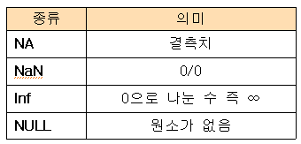

```{r setup, include=FALSE}
knitr::opts_chunk$set(echo = TRUE)
```

## 함수

### [1] c() 함수 이용

- R에서 자료를 생성하는 가장 기본적인 방법은 함수 “c()”를 이용하는 것이다. 이 함수의 괄호 내에 자료를 나열함으로써 자료를 생성한다.

```{r, fig.show='hide'}
x=c(1, 3, 0.5, 5) #수치 자료 벡터
x
```

```{r, fig.show='hide'}
s=c('Kim', 'Lee', 'Park') #문자 자료 벡터
s
```

- 변수 x에는 수치 자료만, 변수 s에는 문자열 자료를 생성하여 할당하고 있다. 

```{r, fig.show='hide'}
x=c(1,3,0.5,5)
c(x, c(0,1))
```

```{r, fig.show='hide'}
s=c(s, 'Choi', 'Lee')
s
```

- 원소의 이름과 함께 입력하고자 할 때는 이름에 자료를 할당하여 입력한다.

```{r, fig.show='hide'}
x=c(x1=1, x2=2, x3=0)
x
```

- 위 결과의 첫 줄은 원소들의 “names”라 한다.  위 결과를 얻는 다른 방법으로 names() 함수를 사용하는 방법이 있다. 

```{r, fig.show='hide'}
x=c(1,2,0)
names(x)=c('x1','x2','x3')
x
```

- 한편, 수치와 문자자료를 함께 생성하면 모두 문자자료로 취급한다는 점을 유의하자. 

```{r, fig.show='hide'}
t=c('Kim',20, 'Lee', 21, 'Park', 25)
t
```

### [2] 콜론 “:” 이용

- 1씩 증가하는 자료 열을 생성하고자 할 때 “:”을 사용하면 편리하다

```{r, fig.show='hide'}
x=1:10; y=-2:2 
x; y
```

- 만약 0.5부터 4.8 사이에서 1씩 증가하는 수열을 만들고자 한다면, 다음과 같이 하라.

```{r, fig.show='hide'}
x=0.5:4.8
x
```

### [3] seq() 함수 이용

- “:”은 1씩 증가하는 수열을 생성한다. 그런데 예를 들어 0.2 씩 증가하는 수열을 만들려면 “seq()” 함수를 이용

**seq(초기값, 최종값, by=증가값) 및 seq(초기값, 최종값, length=길이)**

- 0.5부터 4.8까지 0.2 씩 증가하는 수열

```{r, fig.show='hide'}
x=seq(0.5, 4.8, by=0.2)
x
```

- 증가치로서 음수를 사용할 수 있다.  예를 들어 2에서 1까지 0.1씩 감소하는 수열을 만들어 보자. 

```{r, fig.show='hide'}
x=seq(2.0, 1.0, by=-0.1)
x
```

- 초기치와 최종치 사이를 n 등분하여 수열을 생성할 때는 옵션 "length=n"을 사용한다. 예를 들어 1부터 10 사이를 5등분한 자료를 생성

```{r, fig.show='hide'}
 seq(1, 10, length=5)
```

### [4] rep() 함수

**rep(자료벡터, times=n) 혹은 rep(자료벡터, n)**

```{r, fig.show='hide'}
rep(c(1,2),times=3)
x=c(1,2); rep(x, 3)
rep('Hi! ', 3)
```

- 만약 times를 생략하면, times=1로 간주한다.

### [5] paste() 함수

**paste(문자열, 문자열, …, 문자열, sep=‘구분자’)**

```{r, fig.show='hide'}
paste('Hi,','my', 'R!', sep=' ')
```
3개의 문자열이 빈칸의 구분자로 결합하고 있다.

- 수치 열과 결합하여 연속되는 넘버링을 하는 경우에도 유용
```{r, fig.show='hide'}
paste('X', 1:5, sep='')
```
- paste0() 함수를 이용하면 구분자를 빈칸 없음으로 간주한다.
```{r, fig.show='hide'}
paste0('X', 1:5)
```

####  특수 자료

R에서는 몇 가지 특수한 형태의 자료를 기호로 표시




