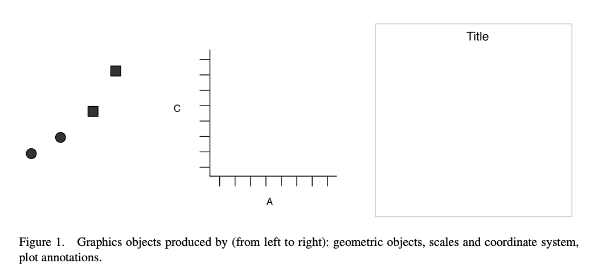
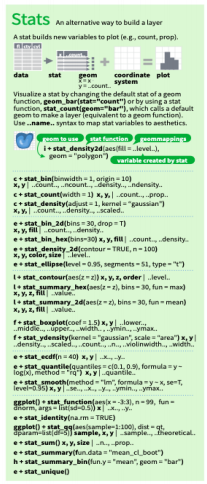
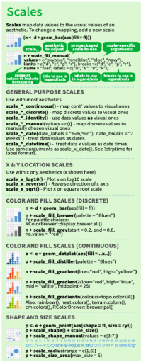
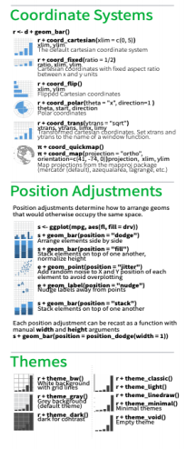
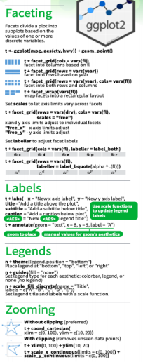
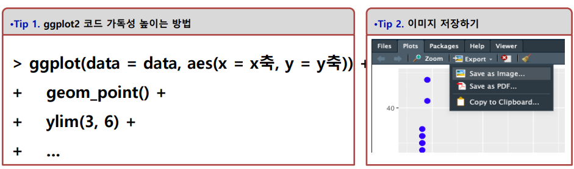

```{r setup, include=FALSE}
knitr::opts_chunk$set(echo = TRUE)
```


한그림이 수천단어보다 가치가 있다는 영어속담과, 명료한 시각화가 데이터분석가에게 다른 어떤 도구보다 더 많은 정보를 제공한다. 

핵심은 시각화이다.

ggplot2 패키지를 활용한 시각화를 먼저 보여줄 것이다. 먼저 간단하게 ggplot2 패키지에 소개하자면 Grammar of Graphics1의 철학을 담아서 R 생태계에서 유명한 학자 중, Hadley Wickham에 의해 주도적으로 개발되었다. 그래프에도 문법이 있다는 패키지의 철학 아래, R의 시각화는 괄목할만한 발전을 이루었고 이는 R의 대중화에도 큰 영향을 끼쳤다.

## 준비

install.packages("ggplot2")

```{r setup3, include=FALSE}
library(ggplot2)
```

**library(ggplot2)를 실행하면**

* Registered ~라는 문구가 나왔다면 컴퓨터내 시스템에서 RStudio 환경으로 ggplot2 패키지를 정상적으로 불러왔다는 뜻

* 패키지 내 다양한 함수를 사용할 수 있는 사전준비가 완료

## 데이트셋 

* 가장 중요한 문제중의 하나인 부동산과 관련하여 시각화를 진행. 

* ggplot2 패키지 내에 존재하는 텍사스 부동산 판매데이터를 통해 시각화를 진행

* 부동산 데이터를 직접 가져와서 시각화를 진행

txhousing 데이터는 총 8602개의 관측치와 9개의 변수로 구성이 되어 있다. txhousing 데이터의 출처 및 각 변수(Column)에 대해 조금 더 자세히 알고 싶다면 R 소스코드 에디터에서 help(txhousing)을 실행하여 도움말을 참고하기를 바란다.

### ggplot2 시각화 예시

먼저 산점도를 시각화를 통해서 ggplot2의 문법에 대해 이해하도록 해보자.

```{r, message = FALSE}
ggplot(data = txhousing, aes(x = listings, y = sales)) + 
  geom_point()
```

* 그래프는 listings 변수와 sales변수 사이에 양의 상관관계가 있는 것으로 확인 되었다

* 그래프는 listings 변수와 sales변수 사이에 양의 상관관계가 있는 것으로 확인 되었

* 기본적으로 ggplot2 그래프는 레이어의 층을 겹겹이 쌓는다고 생각하면 보다 쉽다. 



**순서대로 설명**

* (1) 그래프를 그릴 데이터  

* (2) X축과 Y축에 놓을 변수 

* (3) 그래프의 종류 

* (4) 옵션

```{r, fig.show='hide'}
ggplot(data = txhousing, aes(x = listings, y = sales)) + 
  geom_point()
```

* ggplot(): 그래프를 그릴 함수를 호출한다.

* data = txhousing: txhousing 데이터를 사용한다.

* aes(x = listings, y = sales): x축에는 listings라는 변수를, y축에는 sales라는 변수를 설정한다.

* geom_point(): 산점도라는 종류의 그래프를 그리겠다.

**데이터명와 x축, y축 그리고 그래프의 종류만 바꿔주면 꽤나 근사한 그래프가 나올 수 있다**

## 시각화 종류









### 시각화 패키지 활용한 그래프 작성 기본 원리 

**ggplot(data = data, aes(x=x축, y = y축)) + geom_point() + ylim(3,6) + ...*

